# Zayolabs Developer Interview Exercise

This is a solution for [this repo](https://github.com/zayolab/developer-exercise).

## Screenshots 

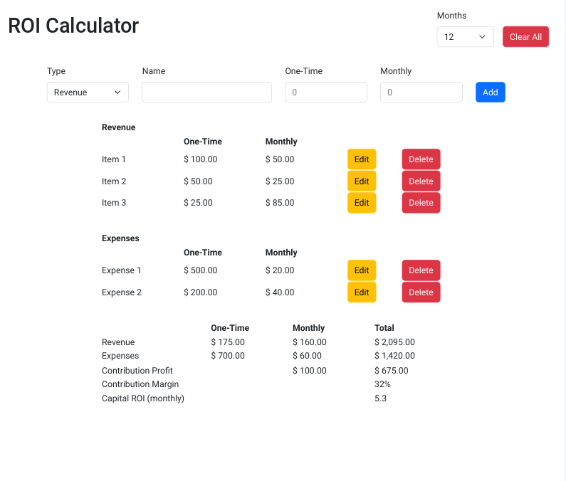

***

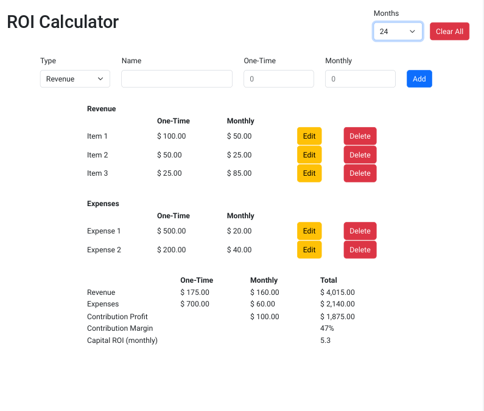

***

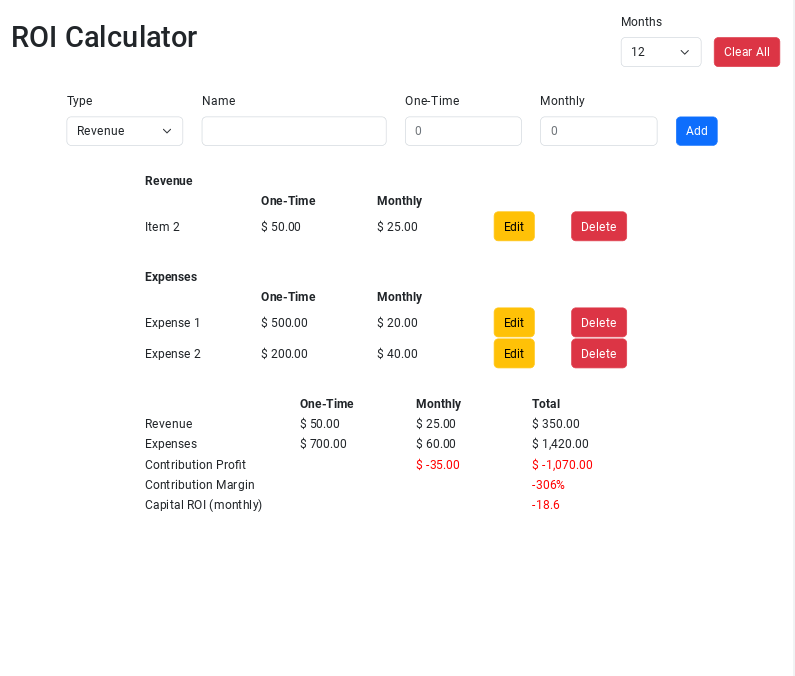

***

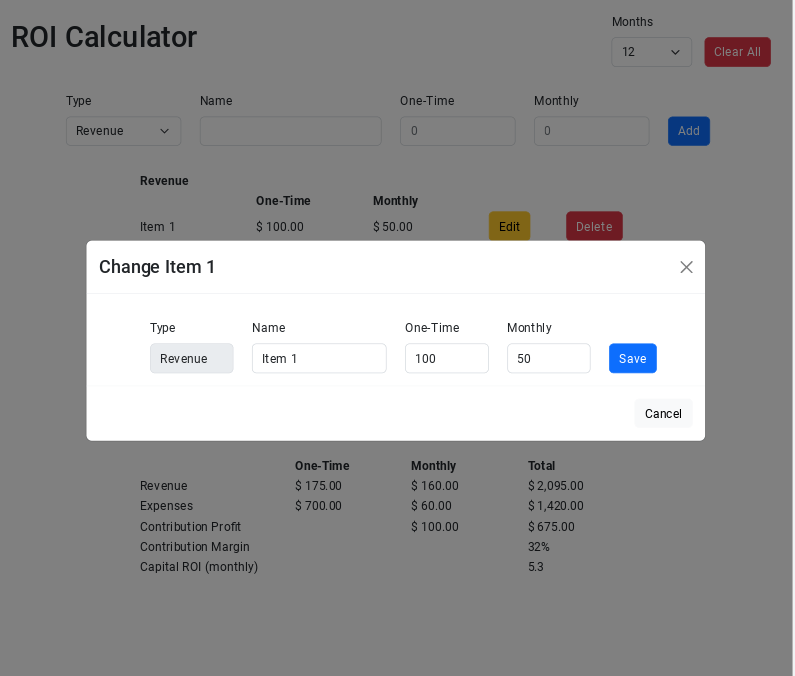

***

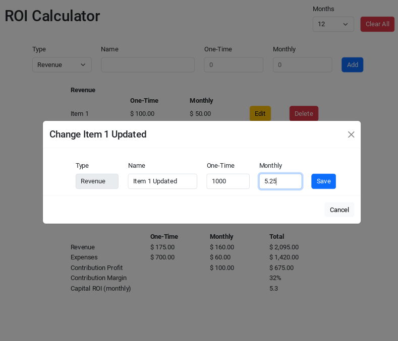

***

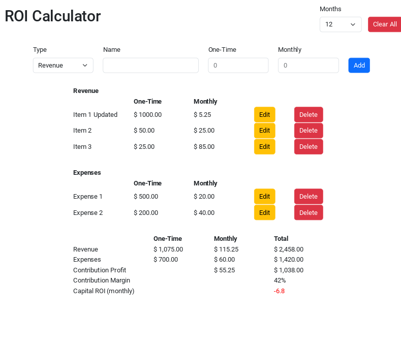

***

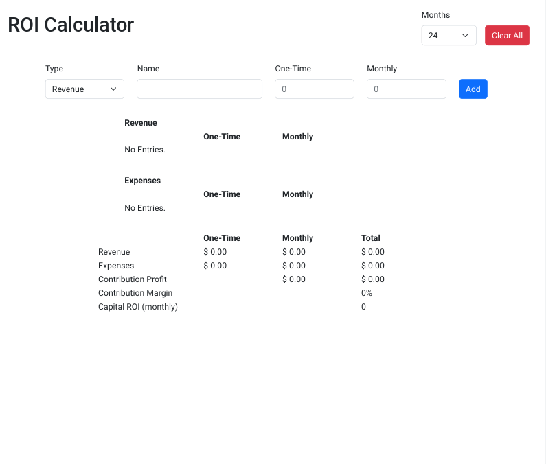

***

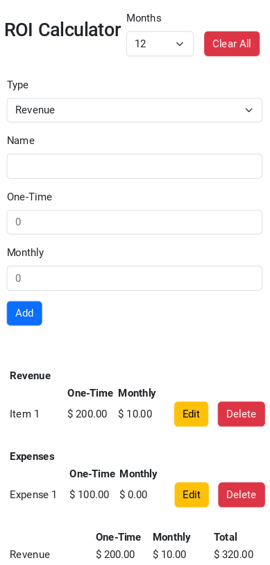

***

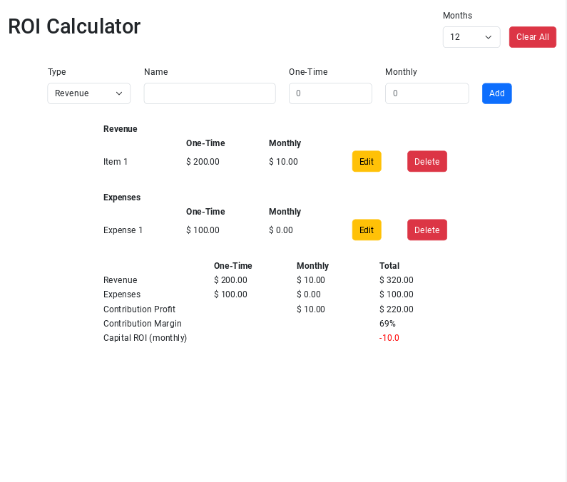

***

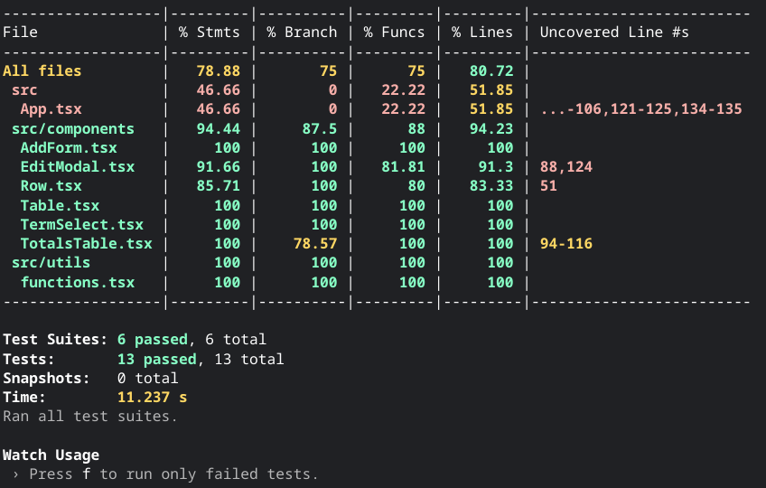

***

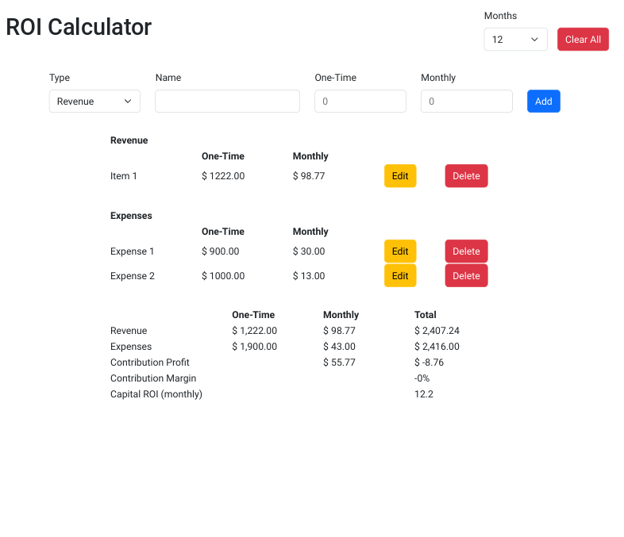

***

## Directions

### ROI Calculator

This application is a ROI Calculator built with React. A ROI (Return of Investment) calculator is an investment calculator that allows you to estimate profit and loss of investments and is particularly helpful when making financial decisions.

### Tasks - Do as many as you'd like. Show us what you've got!
- Break App.js down into reusable components.
- Move calculation tool/utils to its own file.
- Create a Node/Express backend (or stack of your choice) with a rest route to handle the calculations built in the render function of App.js
- Make the totals (revenue, expenses, contribution profit, contribution margin, etc.) reflect a 24 month term (rather than 12) or make the term dynamic, allowing the user to specify a 12, 24, 36, 48, or 60 month term.
- Any other improvements of the application.

The app was built to mimic the functionality of the spreadsheet below.

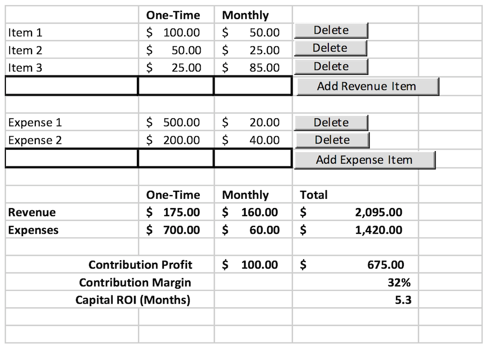

All of the bold fields are calculated fields and should not be editable.  As additional revenue and expense items are added, the calculated fields should update automatically on the page.  As items are deleted, the calculated fields should also update automatically on the page.

All fields should be formatted correctly: currency format, percentage format (for the Contribution Margin), and decimal format (for the Capital ROI).

The following formulas are used in the app to calculate financials:
- One-Time Revenue = Sum of the one-time column of all revenue items
- Monthly Revenue = Sum of the monthly column of all revenue items
- One-Time Expense = Sum of the one-time column of all expense items
- Monthly Expense = Sum of the monthly column of all expense items
- Total Revenue = One-Time Revenue + Monthly Revenue * 12
- Total Expenses = One-Time Expense + Monthly Expenses * 12
- Monthly Contribution Profit = Monthly Revenue – Monthly Expenses
- Total Contribution Profit = Total Revenue – Total Expenses
- Contribution Margin = Total Contribution Profit / Total Revenue
- Capital ROI (Months) = (One-Time Expenses – One-Time Revenue) / Monthly Contribution Profit

## Thoughts 

- Thought about converting to use context to clean up prop drilling
- If you don't add editing functionality - context is not really necessary
- Don't need a global state manager - context should more than enough for this type of application
- Needed to create a row component to get the index / id of item to allow for editing.
- Had to add ids to the dummy data and used crypto module to create ids for the new entries.  
- I left react-bootstrap implementation.  It is not something I would I have chosen although I am comfortable working with bootstrap.
- Leaving react-bootstrap allowed me to use something from the original application as I pretty much got rid of most of it.  
- Used CDN for css required by react-bootstrap - added to public/index.html
- React still doesn't have a definitive table library that can do everything you'd possibly need.  
- [React table library](https://react-table-library.com/) is a new library that seems promising, but it doesn't support typescript yet.  
- Typescript can add a lot of unnecessary headaches for simple things.  
- [This article from Epic React](https://epicreact.dev/how-to-type-a-react-form-on-submit-handler/) shows how convoluted typing a simple event object can be.
- React-bootstrap has complications with typescript - see [Github](https://github.com/DefinitelyTyped/DefinitelyTyped/issues/16208) for more.
- Handling calculations in a rest route is totally unneccessary and would make app performance terrible.   
- Don't need useEffect in TotalsTable to update values since prop changes cause automatic re-renders.      
- Performance optimization of calculations necessary? useMemo ?
- Refactored functions and used utils folder for them. The original variable declarations I used in TotalsTable are commented out in the file.
- Used to localeString to add commas to the numbers
- Went through app and adjusted for some accessibility features - added labels to form inputs in addForm and editModal
- Disabled the type input in the edit modal.  If left available, weird errors and problems highly likely.  
- Instead of empty `<th>`,  it is better to use an empty `<td>`.
- Changing from empty table headers required a css fix from the original styling. 
- Choice to save oneTime and monthly as strings and convert to numbers later or convert automatically to numbers before you save them to state. 
- Originally, had newEntry oneTime and monthly values saved as numbers with starting value of zero - this caused a leading zero problem - although it did not affect calculation.
- Switching newEntry oneTime and monthly types required created another model and changing starting / reset values of newEntry object - no other changes were necessary - may be errors haven't seen yet ?
- I tried to make sure the whole application fit above the fold versus having it stretch further.
- Limited name input length to help with mobile view  
- I thought about having totalsTable go side by side with the other tables, either with flex or grid.   
- React bootstrap modal code had {...props} on the modal element - this causes a react wrapper dom element error.  [Read this article](https://stackoverflow.com/questions/49358560/react-wrapper-react-does-not-recognize-the-staticcontext-prop-on-a-dom-elemen) for more.
- Had problems with typing Table component props because I was passing props that weren't being used.  I forgot to remove       handleNewEntryChange and newEntry after I refactored and made AddForm a separate component. 
- When testing Row separately, you will get validateDOMNesting(...): `<tr>` cannot appear as a child of `
` error because the top level dom element is a tr and it is not wrapped by a tbody tag.  
- Testing - typescript models were being included - need to add jest: {coveragePathIgnorePatterns: `filepaths here` } in package.json to exclude certain files
- Used fireEvent for testing versus including another package for @testing-library/user-event.  

## Improvements

- Typescript improvements - onHide property of EditModal, etc.
- Could make tables have a certain min-height so tables would not collapse with no entries.
- Mobile problems below 425px size
- Possible problem with contributingMargin -  saw -0% as a value - haven't touched original logic - need to investigate 
- Improve tests - limit use of data-testids?
- Convert to use a context as global state
- Airtable integration - seems like a lot of interesting things could be tried.
- Export to CSV ?

## Useful Resources

- [Stack Overflow](https://stackoverflow.com/questions/42081549/typescript-react-event-types) - typescript react event types
- [Freshman](https://freshman.tech/snippets/typescript/fix-value-not-exist-eventtarget/) - fix value does not exist on eventTarget
- [Dave Walsh Blog](https://davidwalsh.name/input-valueasnumber) - valueAsNumber
- [Bobby Hadz](https://bobbyhadz.com/blog/typescript-property-value-not-exist-type-eventtarget) - property value does not exist on eventTarget
- [Github](https://github.com/DefinitelyTyped/DefinitelyTyped/issues/16208) - React bootstrap typing problems
- [React Docs](https://beta.reactjs.org/learn/updating-arrays-in-state) - updating arrays in state
- [Stack Overflow](https://stackoverflow.com/questions/34788403/check-if-javascript-object-only-contains-falsy-values) - object contains falsy values
- [Epic React](https://epicreact.dev/how-to-type-a-react-form-on-submit-handler/) - how to type a react form on submit handler
- [Stack Overflow](https://stackoverflow.com/questions/72572811/react-how-to-pass-onsubmit-handler-through-props-to-the-components) - pass onsubmit handler through props to components
- [Stack Overflow](https://stackoverflow.com/questions/49358560/react-wrapper-react-does-not-recognize-the-staticcontext-prop-on-a-dom-elemen) - react wrapper does not recognize the static context prop on dom element
- [Stack Overflow](https://stackoverflow.com/questions/31581011/how-to-use-tolocalestring-and-tofixed2-in-javascript) - toLocaleString options
- [Stack Overflow](https://stackoverflow.com/questions/54864380/bootstrap-select-option-dropdown-down-arrow-not-showing) - dropdown down arrow not showing bootstrap v5
- [Github](https://github.com/DefinitelyTyped/DefinitelyTyped/issues/16208) - react bootstrap typescript types
- [Stack Overflow](https://stackoverflow.com/questions/67858973/validatedomnesting-tr-cannot-appear-as-a-child-of-div-problem) - validate dom nesting problem
- [Stack Overflow](https://debbie.codes/blog/building-and-testing-select-input/) - building and testing select input
- [Stack Overflow](https://stackoverflow.com/questions/64939196/how-can-i-test-if-a-prop-is-passed-to-child) - test if a prop is passed to child
- [Stack Overflow](https://stackoverflow.com/questions/62473970/best-way-to-test-input-value-in-dom-testing-library-or-react-testing-library) - best way to test input value in react-testing-library
- [Blog](https://robertmarshall.dev/blog/react-component-props-passed-to-child-jest-unit-test/) -  react component props passed to child jest unit test
- [Stack Overflow](https://stackoverflow.com/questions/40486567/how-can-i-exclude-files-from-jest-watch) - exclude files from jest tests
- [Stack Overflow](https://stackoverflow.com/questions/43044696/test-a-create-react-app-index-js-file) - test create react app index file